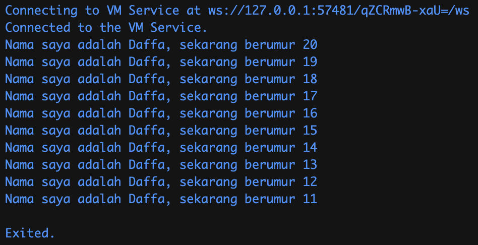

## Praktikum 02 - Dasar Pemrograman Dart dan Pengenalan Konsep Dasar Flutter

| Atribut | Keterangan     |
| ------- | -------------- |
| Nama    | Daffa Putra Prasetya |
| NIM     | 244107060088   |
| Kelas   | SIB-2E         |

---

### Soal 1

Ubahlah bagian kode pada baris ke-3 berikut agar menghasilkan output sesuai dengan ketentuan pada soal!

```dart
void main() {
  for (int i = 0; i < 10; i++) {
    print("Hello ${i + 2}");
  }
}
```

### Jawaban:

```dart
void main() {
  for (int i = 0; i < 10; i++) {
    print('Nama saya adalah Daffa, sekarang berumur ${20 - i}');
  }
}
```


### Soal 2

Mengapa pemahaman terhadap bahasa Dart menjadi hal yang penting sebelum mempelajari dan menggunakan framework Flutter?

### Jawaban:

Karena Dart adalah bahasa pemrograman utama yang digunakan pada Flutter. sehingga, kita harus memahami dasar dasar Dart agar proses pembuatan aplikasi berjalan dengan lancar. Tujuannya agar kita dapat:
* Menguasai struktur dasar program seperti variabel, fungsi, dan perulangan.
* Memahami konsep OOP (Object-Oriented Programming).
* Mengelola error dengan lebih mudah.
* Menulis kode Flutter yang lebih efisien dan terstruktur.

---

### Soal 3

Buatlah ringkasan materi penting dari codelab yang dapat membantu dalam proses pengembangan aplikasi mobile menggunakan Flutter.

### Jawaban:

**1. Dart adalah Bahasa Utama Flutter**

Dart menjadi bahasa pemrograman inti bagi Flutter. Semua kode UI, logika aplikasi, plugin, dan manajemen paket pada Flutter ditulis menggunakan Dart. Memahami dasar dasar Dart sangat penting sebelum mulai membangun aplikasi Flutter. 


**2. Sejarah dan Alasan Dart Dipilih**
* Dart diciptakan untuk mengatasi beberapa keterbatasan bahasa lain (JavaScript).
* Dart memiliki fitur modern seperti sistem tipe yang kuat dan dukungan OOP.
* Karena fleksibilitasnya dan performa yang baik, Dart dipilih sebagai bahasa utama untuk Flutter. 


**3. Cara Kerja Dart**
* **JIT (Just In Time)** — mempercepat pengembangan karena memungkinkan fitur hot reload, yaitu perubahan kode langsung terlihat tanpa restart aplikasi.
* **AOT (Ahead Of Time)** — mengkompilasi ke kode native yang lebih cepat saat aplikasi dirilis. 


**4. Object Oriented Programming (OOP)**
Dart berprinsip OOP, sehingga:
* Semua tipe data bersifat objek
* Adanya fitur seperti class, method, encapsulation, dan inheritance.


**5. Operator dan Sintaks Dasar Dart**
Dart memiliki beberapa operator yaitu:
* Aritmatika (`+`, `-`, `*`, `/`, `%`)
* Relasional dan equality (`==`, `!=`, `>`, `<`)
* Logika (`&&`, `||`, `!`)
* Increment dan decrement (`++`, `--`) 


---

### Soal 4

Jelaskan perbedaan antara Null Safety dan Late Variable beserta contoh kode dan hasil eksekusinya.

### Jawaban:

#### 1. Null Safety

Null Safety memastikan bahwa variabel tidak dapat bernilai `null` kecuali secara eksplisit diizinkan.

**Contoh kode:**

```dart
void main() {
  String? jurusan;
  print(jurusan);
}
```

**Penjelasan:**

* `String` tidak boleh bernilai null.
* `String?` boleh null.
* Jika variabel non nullable diberi nilai null, akan terjadi compiletime error.

---

#### 2. Late Variable

`late` digunakan ketika variabel ingin dideklarasikan sekarang tetapi diinisialisasi nanti.

**Contoh kode:**

```dart
void main() {
  late String jurusan;

  jurusan = "Teknologi Informasi";
  print(jurusan);
}
```

**Penjelasan:**

* Variabel tidak langsung diberi nilai saat deklarasi.
* Harus diinisialisasi sebelum digunakan.
* Jika dipanggil sebelum diberi nilai, akan muncul runtime error.
---