# Praktikum 03 - Pemrograman Dasar Dart - Bag.2 (Percabangan dan Perulangan)

| Atribut | Keterangan     |
| ------- | -------------- |
| Nama    | Daffa Putra Prasetya |
| NIM     | 244107060088   |
| Kelas   | SIB-2E         |

---

## Praktikum 1: Menerapkan Control Flows ("if/else")

### Langkah 1
Ketik atau salin kode program berikut ke dalam fungsi `main()`.

```dart
void main() {
  String test = "test2";
  if (test == "test1") {
    print("Test1");
  } else If (test == "test2") {
    print("Test2");
  } Else {
    print("Something else");
  }

  if (test == "test2") print("Test2 again");
}
```

### Langkah 2:
Silakan coba eksekusi (Run) kode pada langkah 1 tersebut. Apa yang terjadi? Jelaskan!

**Jawab:**

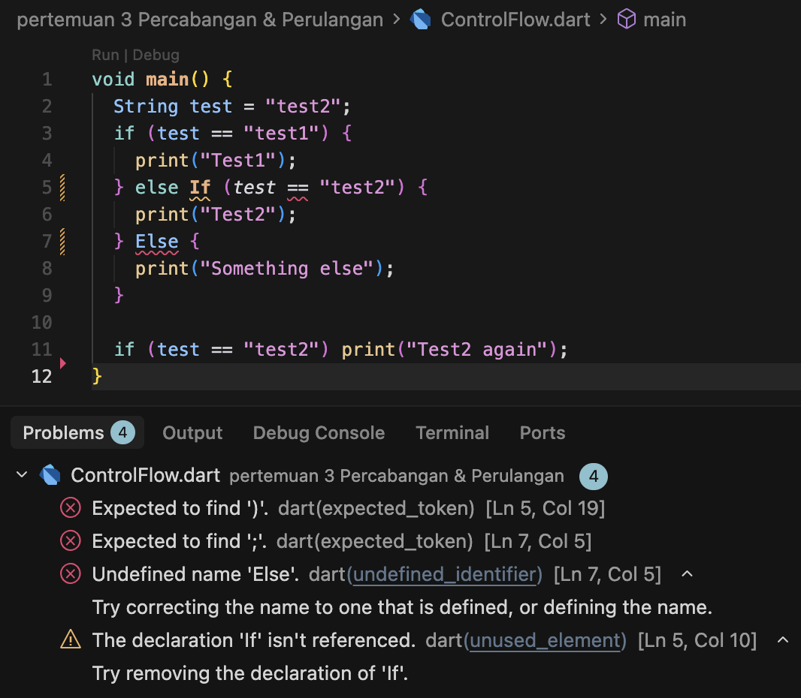

Kode tersebut terjadi error karena penulisan if else nya salah. bahasa dart bersifat case sensitive, jadi else If dan Else dianggap tidak valid. Yang benar harus ditulis else if dan else dengan huruf kecil semua. seharusnya kode seperti dibawah ini

```dart
void main() {
  String test = "test2";
  if (test == "test1") {
    print("Test1");
  } else if (test == "test2") {
    print("Test2");
  } else {
    print("Something else");
  }

  if (test == "test2") print("Test2 again");
}
```
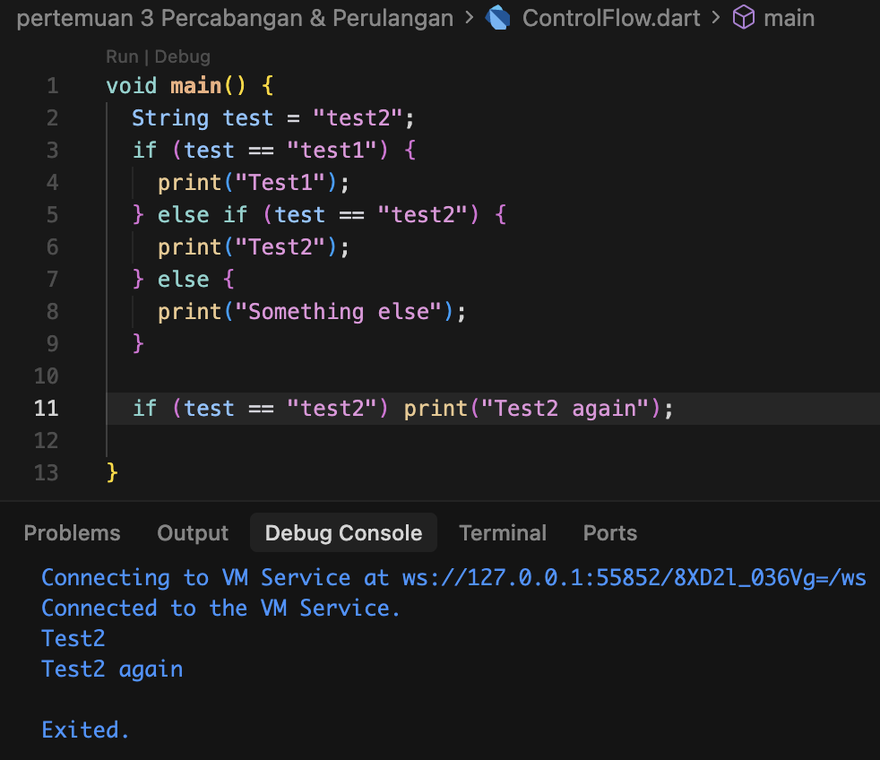

### Langkah 3

Tambahkan kode program berikut, lalu coba eksekusi (Run) kode Anda.

```dart
String test = "true";
if (test) {
   print("Kebenaran");
}
```

**Jawab:**

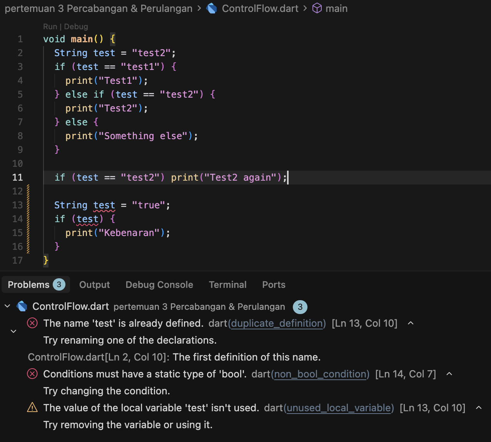

Pada kode error terjadi karena variabel test dideklarasikan dua kali dalam satu scope. Selain itu, test diisi string "true" tapi langsung dipakai di kondisi if , padahal if harus bertipe bool, bukan String. sehingga muncul error non-bool condition dan peringatan variabel tidak terpakai. Intinya, nama variabel harus unik dan kondisi if wajib berupa nilai boolean. berikut perbaikannya

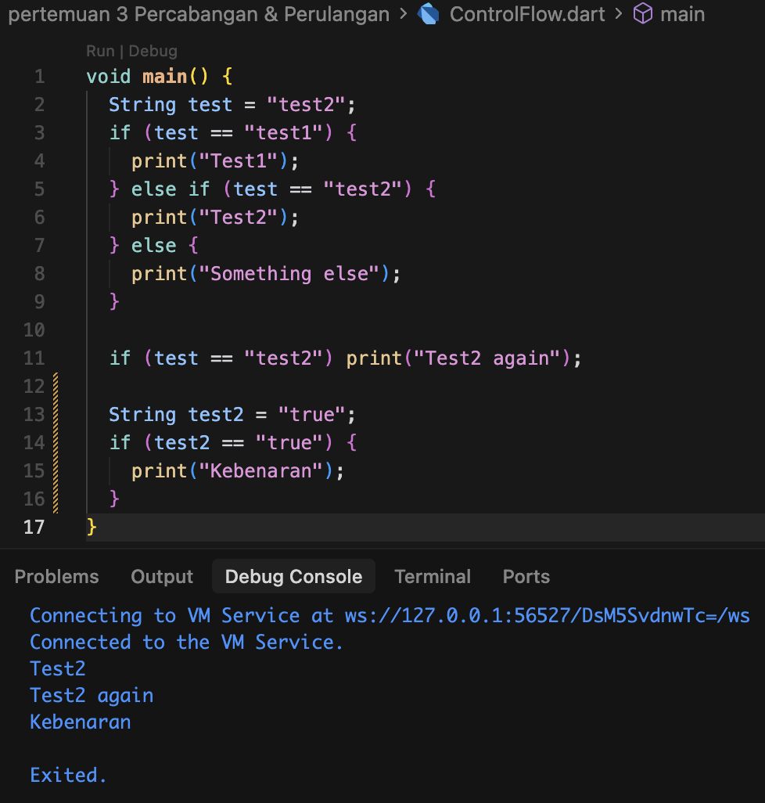


## Praktikum 2: Menerapkan Perulangan "while" dan "do-while"

### Langkah 1

Ketik atau salin kode program berikut ke dalam fungsi `main()`.

```dart
void main() {
  while (counter < 33) {
    print(counter);
    counter++;
  }
}
```

### Langkah 2

Silakan coba eksekusi (Run) kode pada langkah 1 tersebut. Apa yang terjadi? Jelaskan! Lalu perbaiki jika terjadi error.

**Jawab:**

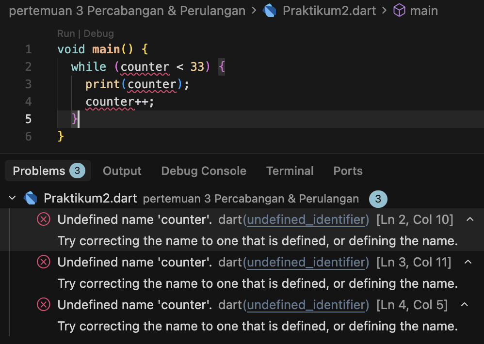

Pada kode tersebut error muncul karena variabel counter dipakai di while, print, dan counter++ tanpa pernah dideklarasikan terlebih dahulu. bahasa dart tidak otomatis membuat variabel, jadi harus ada deklarasi dan nilai awalnya sebelum dipakai. Karena counter tidak dikenali, semua baris yang memakainya dianggap error.

berikut perbaikannya

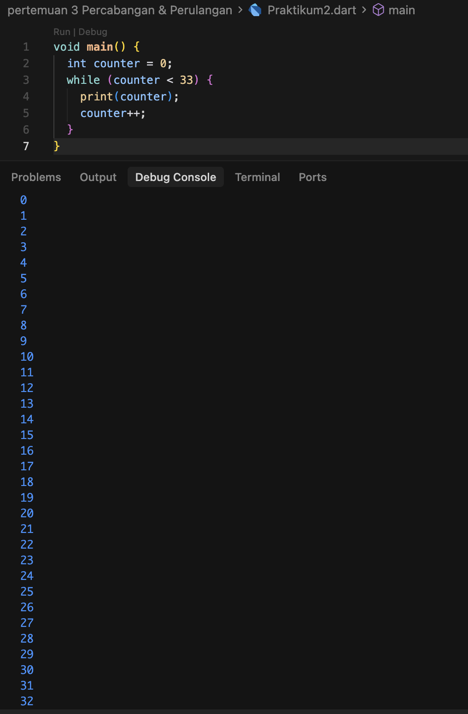

### Langkah 3

Tambahkan kode program berikut, lalu coba eksekusi (Run) kode Anda.

```dart
do {
  print(counter);
  counter++;
} while (counter < 77);
```

**Jawab:**

Pada kode tersebut, perulangan do-while menggunakan nilai counter terakhir yang dihasilkan dari perulangan while, yaitu 33. Sehingga, proses perulangan akan terus berjalan mulai dari angka 33 dan berhenti ketika counter mencapai 76

Kode:
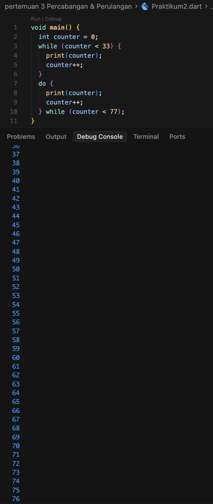


## Praktikum 3: Menerapkan Perulangan "for" dan "break-continue"

### Langkah 1

Ketik atau salin kode program berikut ke dalam fungsi `main()`.

```dart
void main() {
  for (Index = 10; index < 27; index) {
    print(Index);
  }
}
```

### Langkah 2

Silakan coba eksekusi (Run) kode pada langkah 1 tersebut. Apa yang terjadi? Jelaskan! Lalu perbaiki jika terjadi error.

**Jawab:**

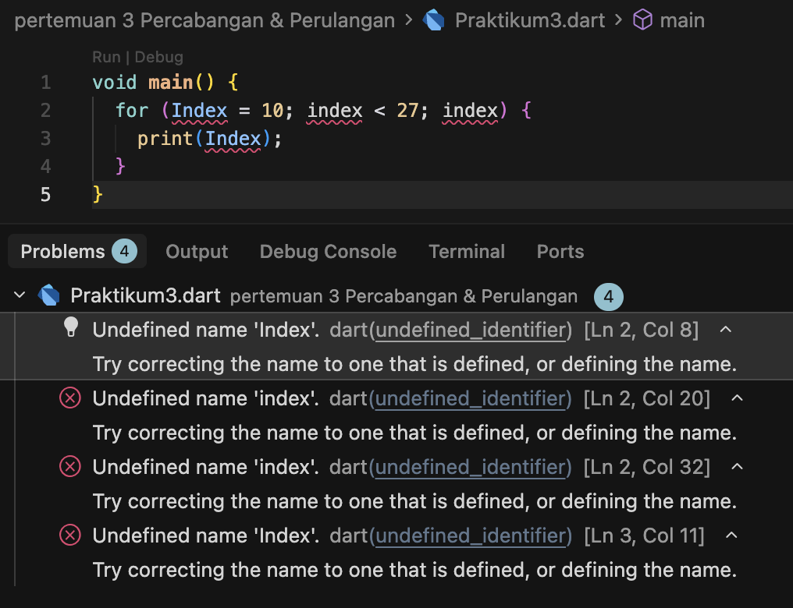

Pada kode tersebut error terjadi karena variabel Index dan index belum dideklarasikan di dalam perulangan for, sehingga program menganggapnya tidak dikenal. Selain itu, penulisan nama variabel tidak konsisten karena Dart bersifat case sensitive, jadi Index dan index dianggap berbeda. Di bagian increment juga salah karena variabel tidak bertambah nilainya. Sehingga, seluruh bagian for menghasilkan error undefined name.

Berikut perbaikannya

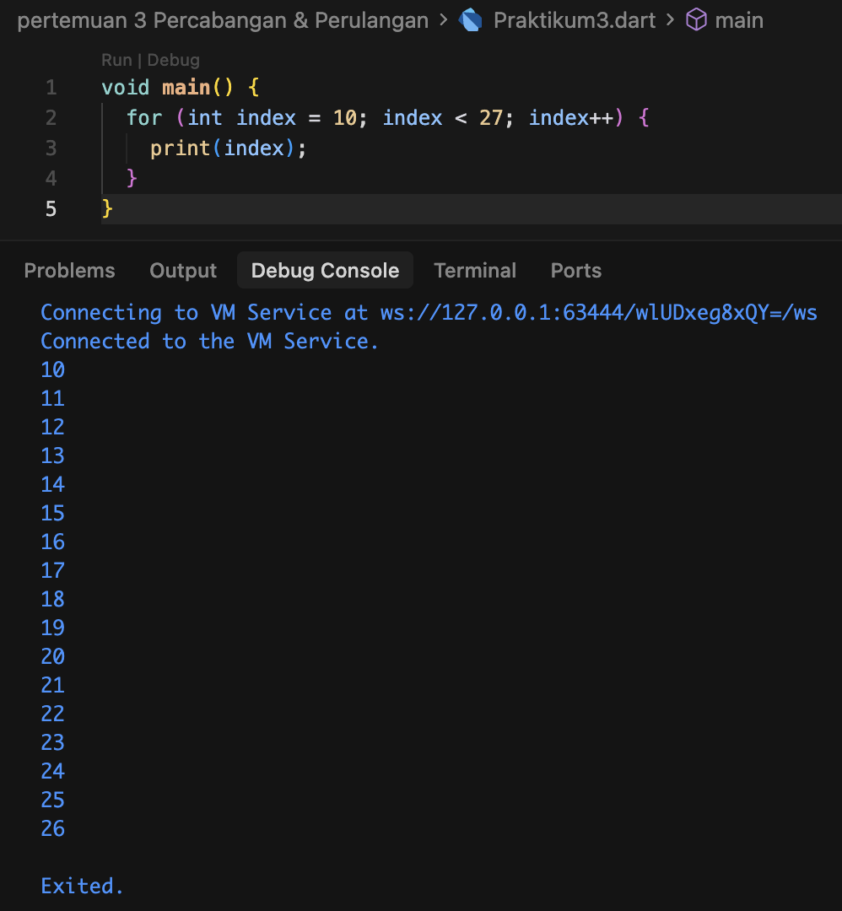

### Langkah 3

Tambahkan kode program berikut di dalam `for-loop`, lalu coba eksekusi (Run) kode Anda.

```dart
If (Index == 21) break;
Else If (index > 1 || index < 7) continue;
print(index);
```

**Jawab:**

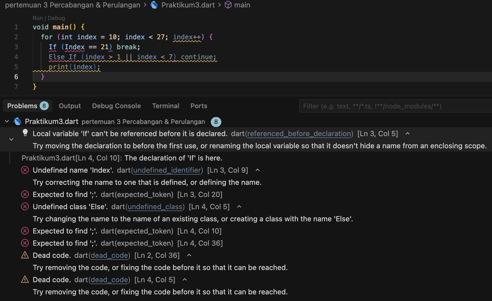

Pada kode tersebut error muncul karena penulisan if dan else if salah, yaitu ditulis If dan Else If, padahal dart bersifat case sensitive sehingga harus huruf kecil semua. Selain itu, variabel yang dipakai tidak konsisten antara Index dan index, sehingga dianggap variabel yang berbeda dan memicu error undefined name.

berikut perbaikannya

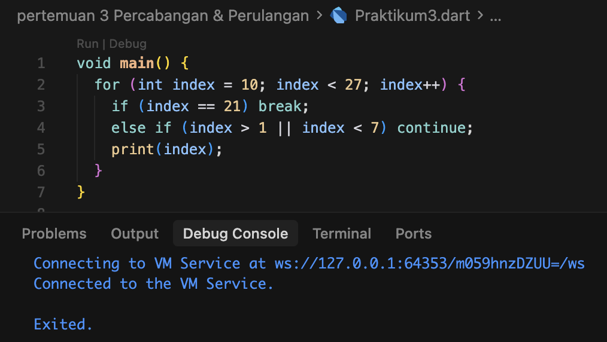

---

# TUGAS PRAKTIKUM

1. Silakan selesaikan Praktikum 1 sampai 3, lalu dokumentasikan berupa screenshot hasil pekerjaan beserta penjelasannya!
2. Buatlah sebuah program yang dapat menampilkan bilangan prima dari angka 0 sampai 201 menggunakan Dart. Ketika bilangan prima ditemukan, maka tampilkan nama lengkap dan NIM Anda.

## Jawab
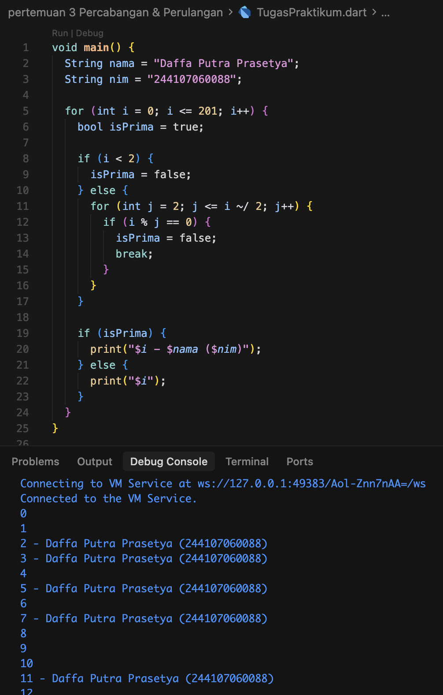


