# Praktikum 04 - Pemrograman Dasar Dart - Bag.3 (Collections dan Functions)

| Atribut | Keterangan     |
| ------- | -------------- |
| Nama    | Daffa Putra Prasetya |
| NIM     | 244107060088   |
| Kelas   | SIB-2E         |

---

## Praktikum 1: Eksperimen Tipe Data List

### Langkah 1

Ketik atau salin kode program berikut ke dalam fungsi `main()`.

```dart
void main() {
  var list = [1, 2, 3];

  assert(list.length == 3);
  assert(list[1] == 2);

  print(list.length);
  print(list[1]);

  list[1] = 1;
  assert(list[1] == 1);
  print(list[1]);
}
```

### Langkah 2

Silakan coba eksekusi (Run) kode pada langkah 1 tersebut. Apa yang terjadi? Jelaskan!

**Jawab:**

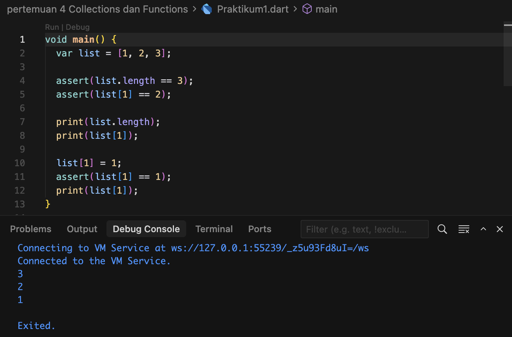

Saat dijalankan, program menampilkan nilai `3`, `2`, dan `1`. Nilai `3` berasal dari `print(list.length)` karena panjang list adalah 3 elemen. Nilai `2` berasal dari `print(list[1])` sebelum diubah, karena elemen pada index ke-1 bernilai 2. Setelah `list[1] = 1;`, elemen index ke-1 berubah menjadi 1, sehingga `print(list[1])` terakhir menampilkan angka 1.

### Langkah 3

Ubah kode pada langkah 1 menjadi variabel `final` yang mempunyai index = 5 dengan default value = `null`. Isilah nama dan NIM Anda pada elemen index ke-1 dan ke-2. Lalu print dan capture hasilnya.

**Jawab:**

```dart
void main() {
  final List<String?> list = List.filled(5, null);

  list[1] = "Daffa Putra Prasetya";
  list[2] = "244107060088"; 

  print(list);
  print("Panjang list: ${list.length}");
  print("Elemen index 1 (Nama): ${list[1]}");
  print("Elemen index 2 (NIM): ${list[2]}");
}
```

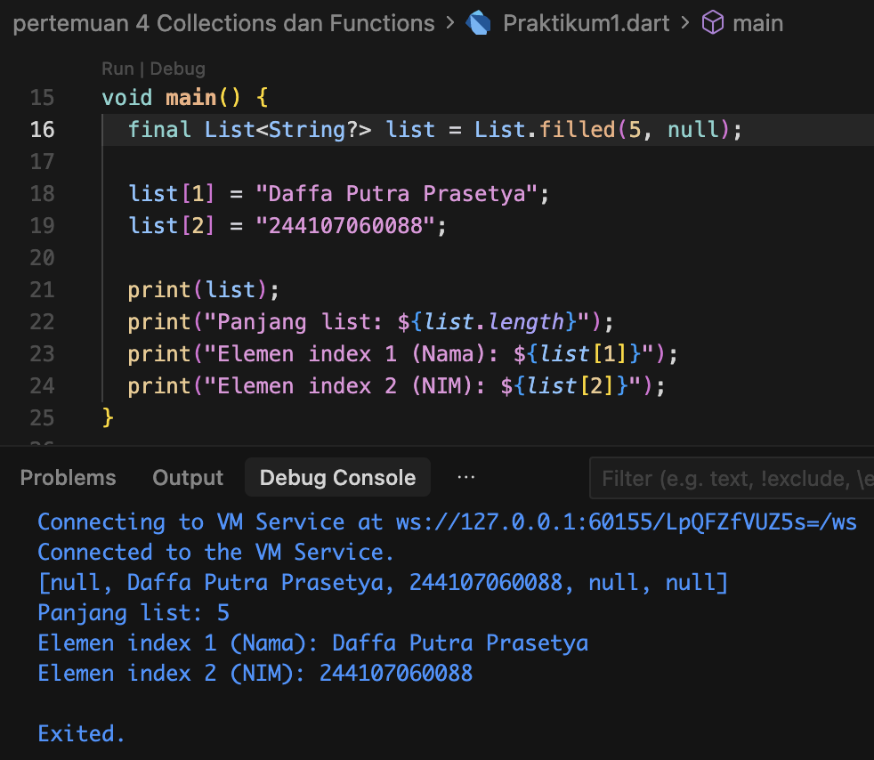

Pada langkah ini, variabel diubah menjadi `final` dengan list berukuran 5 elemen dan nilai awal `null`. Elemen index 1 diisi dengan nama dan index 2 diisi dengan NIM, sehingga saat dicetak, list menampilkan nilai `null` pada index lain dan menampilkan nama serta NIM pada index yang telah diisi. Karena tipenya `List<String?>`, semua elemen boleh bernilai `null` atau `String` sehingga tidak terjadi error tipe data.

---

## Praktikum 2: Eksperimen Tipe Data Set

### Langkah 1

Ketik atau salin kode program berikut ke dalam fungsi `main()`.

```dart
void main() {
  var halogens = {'fluorine', 'chlorine', 'bromine', 'iodine', 'astatine'};
  print(halogens);
}
```

### Langkah 2

Silakan coba eksekusi (Run) kode pada langkah 1 tersebut. Apa yang terjadi? Jelaskan! Lalu perbaiki jika terjadi error.

**Jawab:**

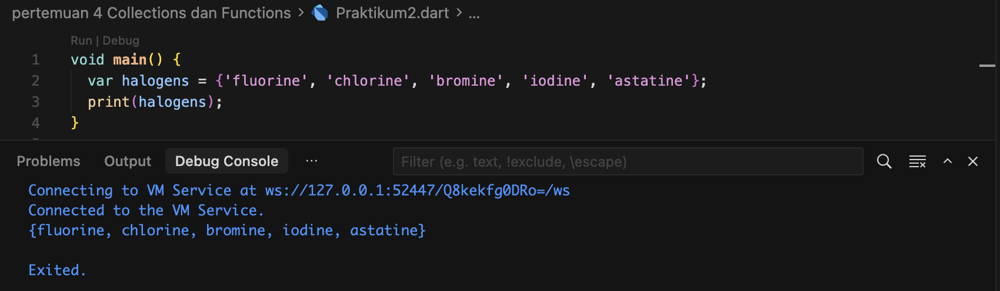

Program akan mencetak sebuah `Set` berisi nama-nama unsur halogen. Urutan elemen yang tampil bisa berbeda dengan urutan penulisan karena `Set` tidak menjamin urutan, tetapi isinya tetap sama dan setiap elemen bersifat unik (tidak ada duplikasi).

### Langkah 3

Tambahkan kode program berikut, lalu coba eksekusi (Run) kode Anda.

```dart
var names1 = <String>{};
Set<String> names2 = {}; // This works, too.
var names3 = {};        // Creates a map, not a set.

print(names1);
print(names2);
print(names3);
```

Apa yang terjadi? Jika terjadi error, silakan perbaiki namun tetap menggunakan ketiga variabel tersebut. Tambahkan elemen nama dan NIM Anda pada kedua variabel `Set` tersebut dengan dua fungsi berbeda yaitu `.add()` dan `.addAll()`. Untuk variabel `Map` dibiarkan, nanti akan kita coba di praktikum selanjutnya.

**Jawab:**

```dart
void main() {
  var halogens = {'fluorine', 'chlorine', 'bromine', 'iodine', 'astatine'};
  print(halogens);

  var names1 = <String>{};
  Set<String> names2 = {};
  var names3 = {}; 

  names1.add("Daffa Putra Prasetya");
  names1.addAll({"244107060088"});

  names2.add("Daffa Putra Prasetya");
  names2.addAll({"244107060088"});

  names3["nama"] = "Daffa Putra Prasetya";
  names3["nim"] = "244107060088";

  print(names1);
  print(names2);
  print(names3);
}
```

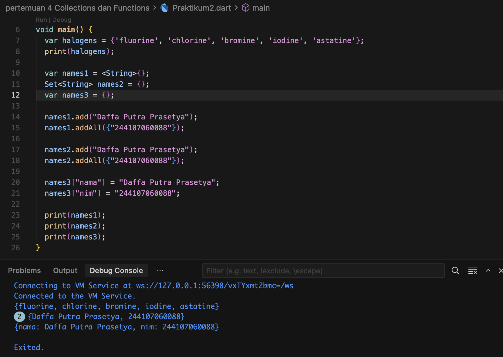

Pada langkah ini, `names1` dan `names2` adalah `Set<String>` sehingga hanya menyimpan kumpulan nilai unik bertipe `String`. Metode `.add()` menambahkan satu elemen, sedangkan `.addAll()` menambahkan beberapa elemen sekaligus. Variabel `names3` sebenarnya bertipe `Map` sehingga kita menambahkan pasangan `key-value` dengan sintaks `names3["key"] = "value"`. Hasil cetak menunjukkan perbedaan struktur antara `Set` dan `Map`.

---

## Praktikum 3: Eksperimen Tipe Data Maps

### Langkah 1

Ketik atau salin kode program berikut ke dalam fungsi `main()`.

```dart
void main() {
  var gifts = {
    // Key:    Value
    'first': 'partridge',
    'second': 'turtledoves',
    'fifth': 1,
  };

  var nobleGases = {
    2: 'helium',
    10: 'neon',
    18: 2,
  };

  print(gifts);
  print(nobleGases);
}
```

### Langkah 2

Silakan coba eksekusi (Run) kode pada langkah 1 tersebut. Apa yang terjadi? Jelaskan! Lalu perbaiki jika terjadi error.

**Jawab:**

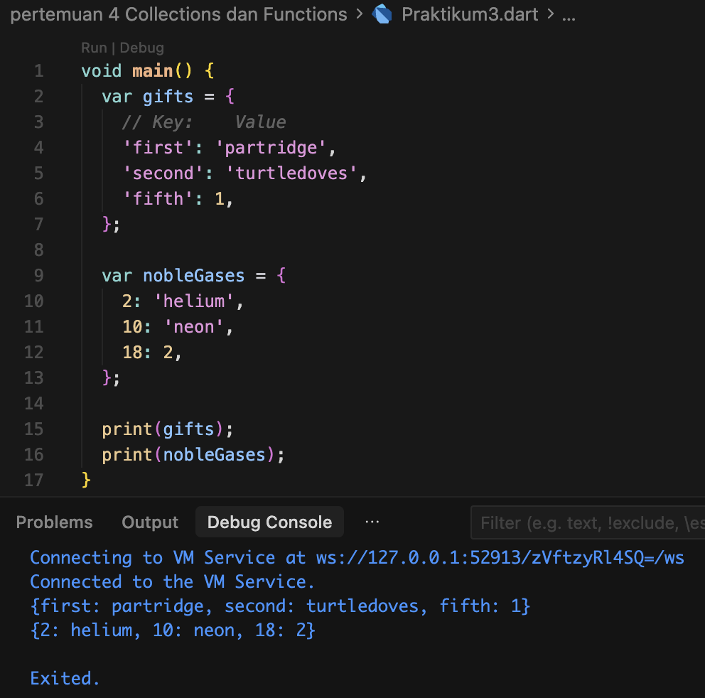

Program mencetak dua buah `Map`: `gifts` dengan key bertipe `String` dan `nobleGases` dengan key bertipe `int`. Setiap elemen pada `Map` berupa pasangan `key-value`, sehingga saat dicetak akan terlihat struktur seperti `{key: value}` untuk masing-masing pasangan.

### Langkah 3

Tambahkan kode program berikut, lalu coba eksekusi (Run) kode Anda.

```dart
var mhs1 = Map<String, String>();
gifts['first'] = 'partridge';
gifts['second'] = 'turtledoves';
gifts['fifth'] = 'golden rings';

var mhs2 = Map<int, String>();
nobleGases[2] = 'helium';
nobleGases[10] = 'neon';
nobleGases[18] = 'argon';
```

Apa yang terjadi? Jika terjadi error, silakan perbaiki. Tambahkan elemen nama dan NIM Anda pada tiap variabel di atas (`gifts`, `nobleGases`, `mhs1`, dan `mhs2`). Dokumentasikan hasilnya dan buat laporannya.

**Jawab:**

Kode Langkah 3 mengikuti urutan soal: tetap pakai `gifts` dan `nobleGases` dari Langkah 1, lalu **tambahkan** blok kode yang mendeklarasikan `mhs1`/`mhs2` serta mengisi ulang nilai `gifts` dan `nobleGases`, baru setelah itu isi nama dan NIM ke keempat variabel.

```dart
void main() {
  var gifts = {
    'first': 'partridge',
    'second': 'turtledoves',
    'fifth': 1,
  };

  var nobleGases = {
    2: 'helium',
    10: 'neon',
    18: 2,
  };

  print(gifts);
  print(nobleGases);

  var mhs1 = Map<String, String>();
  gifts['first'] = 'partridge';
  gifts['second'] = 'turtledoves';
  gifts['fifth'] = 'golden rings';

  var mhs2 = Map<int, String>();
  nobleGases[2] = 'helium';
  nobleGases[10] = 'neon';
  nobleGases[18] = 'argon';

  gifts['nama'] = 'Daffa Putra Prasetya';
  gifts['nim'] = '244107060088';
  nobleGases[244107060088] = 'Daffa Putra Prasetya';
  mhs1['nama'] = 'Daffa Putra Prasetya';
  mhs1['nim'] = '244107060088';
  mhs2[244107060088] = 'Daffa Putra Prasetya';

  print(gifts);
  print(nobleGases);
  print(mhs1);
  print(mhs2);
}
```

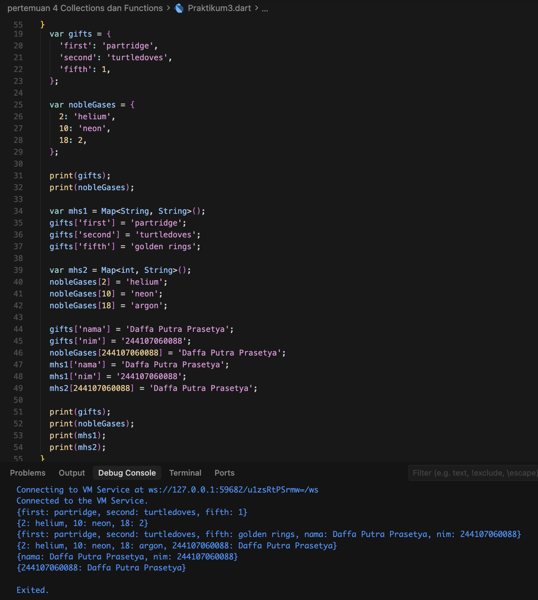

Pada langkah ini, `gifts` dan `nobleGases` tetap berupa `Map` tetapi ditambahkan pasangan `key-value` baru berisi nama dan NIM. `mhs1` dan `mhs2` juga didefinisikan sebagai `Map` yang dapat menyimpan informasi mahasiswa dengan key `String` atau `int`. Hasil cetak menunjukkan bagaimana data dapat disimpan dan diakses menggunakan pasangan `key-value` pada `Map`.

---

## Praktikum 4: Eksperimen Tipe Data List: Spread dan Control-flow Operators

### Langkah 1

Ketik atau salin kode program berikut ke dalam fungsi `main()`.

```dart
void main() {
  var list = [1, 2, 3];
  var list2 = [0, ...list];

  print(list);
  print(list2);
  print(list2.length);
}
```

### Langkah 2

Silakan coba eksekusi (Run) kode pada langkah 1 tersebut. Apa yang terjadi? Jelaskan! Lalu perbaiki jika terjadi error.

**Jawab:**

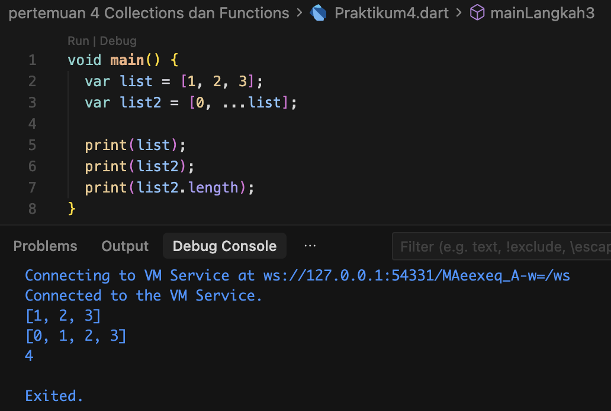

Program mencetak `list` berisi `[1, 2, 3]` dan `list2` berisi `[0, 1, 2, 3]`. Operator spread `...list` menyalin seluruh elemen `list` ke dalam `list2`, sehingga panjang `list2` menjadi 4 karena ada elemen `0` di awal dan tiga elemen dari `list`.

### Langkah 3

Tambahkan kode program berikut, lalu coba eksekusi (Run) kode Anda.

```dart
void main() {
  var list1 = [2, null];
  print(list1);

  var list3 = [0, ...list1];
  print(list3);
  print(list3.length);

  var nimList = ['244107060088'];
  var combined = [...list3, ...nimList];
  print(nimList);
  print(combined);
}
```

Apa yang terjadi? Jika terjadi error, silakan perbaiki. Tambahkan variabel list berisi NIM Anda menggunakan Spread Operators. Dokumentasikan hasilnya dan buat laporannya!

**Jawab:**

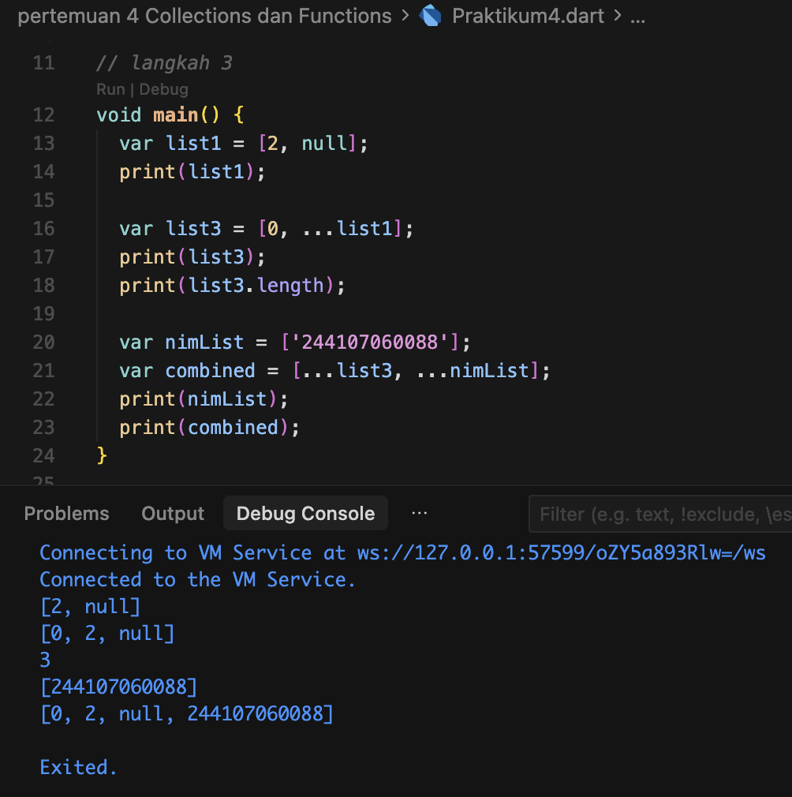

Kode berjalan tanpa error. `list1` berisi `[2, null]`, lalu saat disebarkan ke `list3` hasilnya menjadi `[0, 2, null]` dengan panjang 3 elemen. Setelah itu dibuat `nimList` yang berisi NIM (`['244107060088']`) dan digabungkan dengan `list3` menggunakan spread operator menjadi list baru `combined`. Ini menunjukkan bahwa spread operator dapat digunakan untuk menggabungkan beberapa list, termasuk list yang berisi nilai `null` maupun string NIM, ke dalam satu list gabungan.

### Langkah 4

Tambahkan kode program berikut, lalu coba eksekusi (Run) kode Anda.

```dart
void main() {
  bool promoActive = true; 
  var nav = ['Home', 'Furniture', 'Plants', if (promoActive) 'Outlet'];
  print('promoActive = $promoActive -> $nav');
}
```

Apa yang terjadi? Jika terjadi error, silakan perbaiki. Tunjukkan hasilnya jika variabel `promoActive` ketika `true` dan `false`.

**Jawab:**

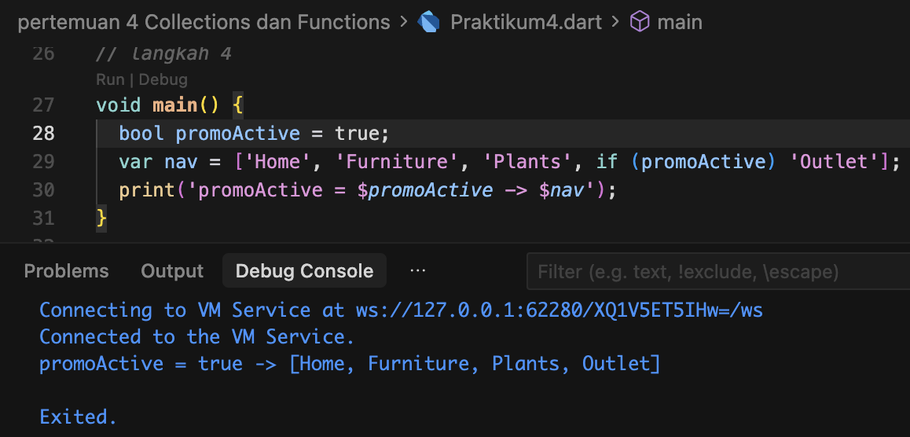
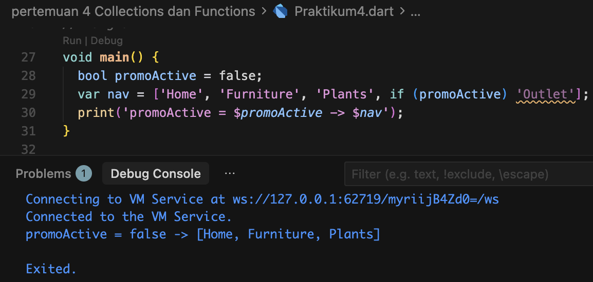

Ketika `promoActive = true`, list `nav` berisi `['Home', 'Furniture', 'Plants', 'Outlet']` karena elemen `'Outlet'` ikut dimasukkan oleh ekspresi `if`. Saat `promoActive = false`, elemen `'Outlet'` tidak dimasukkan sehingga `nav` hanya berisi `['Home', 'Furniture', 'Plants']`. Ini menunjukkan penggunaan control-flow `if` di dalam literal list.

### Langkah 5

Tambahkan kode program berikut, lalu coba eksekusi (Run) kode Anda.

```dart
void main() {
  String login = 'User';
  var nav2 = ['Home', 'Furniture', 'Plants', if (login case 'Manager') 'Inventory'];
  print('login = User -> $nav2');
}
```

Apa yang terjadi? Jika terjadi error, silakan perbaiki. Tunjukkan hasilnya jika variabel `login` mempunyai kondisi lain.

**Jawab:**

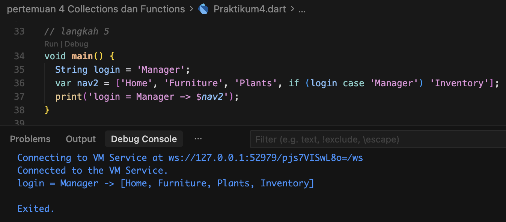
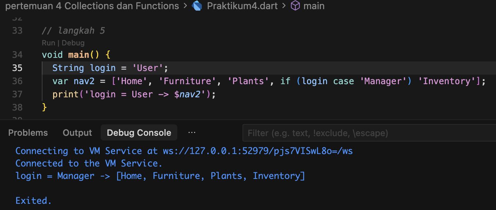


Saat `login = 'Manager'`, list `nav2` berisi `['Home', 'Furniture', 'Plants', 'Inventory']` karena kondisi `login case 'Manager'` terpenuhi. Ketika `login` diubah menjadi nilai lain seperti `'User'`, elemen `'Inventory'` tidak ditambahkan sehingga list navigasi hanya berisi menu dasar tanpa menu khusus manajer.

### Langkah 6

Tambahkan kode program berikut, lalu coba eksekusi (Run) kode Anda.

```dart
void main() {
  var listOfInts = [1, 2, 3];
  var listOfStrings = ['#0', for (var i in listOfInts) '#$i'];

  assert(listOfStrings[1] == '#1');
  print(listOfStrings);
}
```

Apa yang terjadi? Jika terjadi error, silakan perbaiki. Jelaskan manfaat Collection For dan dokumentasikan hasilnya.

**Jawab:**

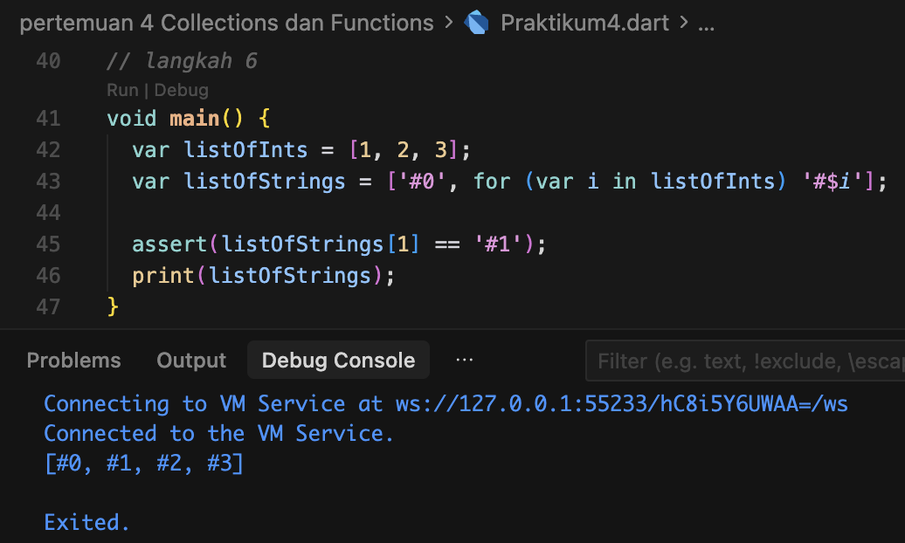

Program menghasilkan list string `['#0', '#1', '#2', '#3']`. Ekspresi `for (var i in listOfInts) '#$i'` di dalam list disebut *collection for*, yang memudahkan membuat list baru berdasarkan iterasi dari list lain tanpa perlu loop terpisah. Manfaatnya adalah kode menjadi lebih ringkas, mudah dibaca, dan tetap aman karena masih mengikuti aturan tipe data Dart.

---

## Praktikum 5: Eksperimen Tipe Data Records

### Langkah 1

Ketik atau salin kode program berikut ke dalam fungsi `main()`.

```dart
void main() {
  var record = ('first', a: 2, b: true, 'last');
  print(record);
}
```

### Langkah 2

Silakan coba eksekusi (Run) kode pada langkah 1 tersebut. Apa yang terjadi? Jelaskan! Lalu perbaiki jika terjadi error.

**Jawab:**

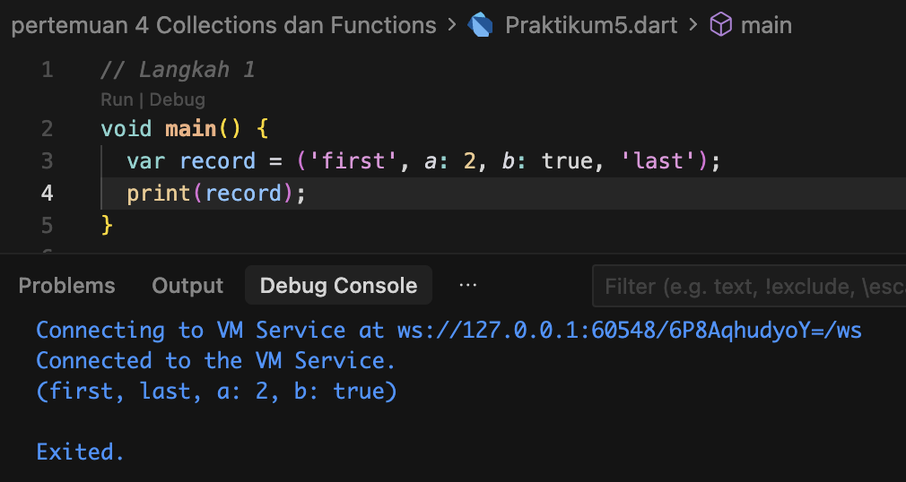

Program mencetak sebuah record `('first', a: 2, b: true, 'last')` yang berisi kombinasi field posisi dan field bernama. Dari output terlihat bahwa record dapat menyimpan beberapa nilai dengan tipe berbeda dalam satu variabel.

### Langkah 3

Tambahkan kode program berikut di luar scope `void main()`, lalu coba eksekusi (Run) kode Anda.

```dart
(int, int) tukar((int, int) record) {
  var (a, b) = record;
  return (b, a);
}

void main() {
  var record = (10, 20);
  print('Record awal : $record');

  var hasilTukar = tukar(record);
  print('Record setelah tukar : $hasilTukar');
}
```

Apa yang terjadi? Jika terjadi error, silakan perbaiki. Gunakan fungsi `tukar()` di dalam `main()` sehingga tampak jelas proses pertukaran value field di dalam Records.

**Jawab:**

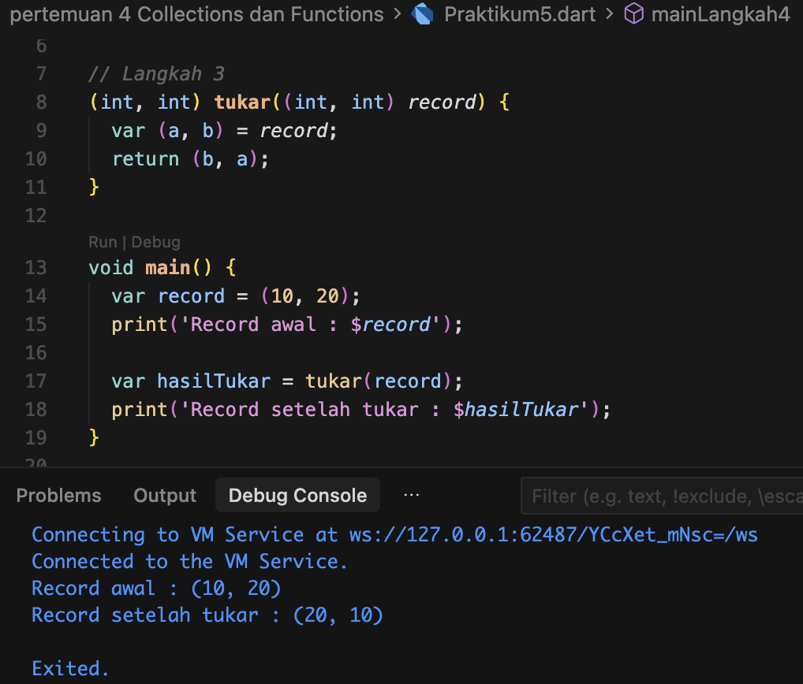

Saat `main()` dijalankan, record awal `(10, 20)` dicetak terlebih dahulu, lalu fungsi `tukar()` mengembalikan record baru `(20, 10)` sehingga urutan nilainya tertukar. Ini menunjukkan bahwa record dapat diperlakukan seperti kumpulan nilai yang bisa di-*destructure* dan dibentuk ulang dengan urutan berbeda.

### Langkah 4

Tambahkan kode program berikut di dalam scope `void main()`, lalu coba eksekusi (Run) kode Anda.

```dart
void main() {
  (String, int) mahasiswa;
  mahasiswa = ('Daffa Putra Prasetya', 244107060088);

  print(mahasiswa);
}
```

Apa yang terjadi? Jika terjadi error, silakan perbaiki. Inisialisasi field nama dan NIM Anda pada variabel record `mahasiswa` di atas. Dokumentasikan hasilnya dan buat laporannya!

**Jawab:**

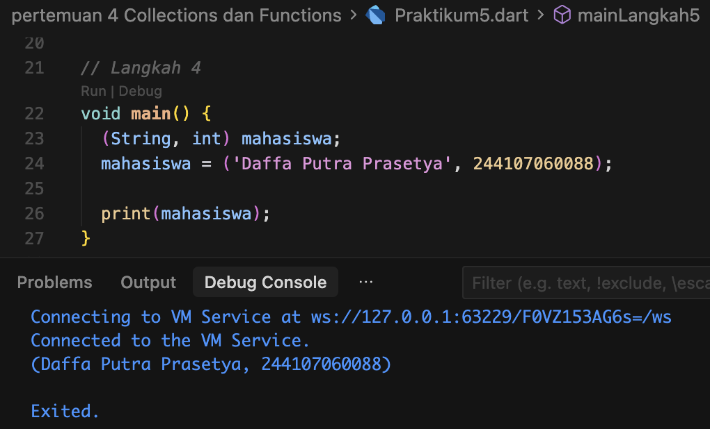

Record `mahasiswa` bertipe `(String, int)` berhasil diinisialisasi dengan nilai `('Daffa Putra Prasetya', 244107060088)` dan dicetak tanpa error. Ini menunjukkan bahwa record dapat digunakan seperti tipe data gabungan untuk menyimpan beberapa informasi (nama dan NIM) dalam satu variabel dengan tipe yang jelas.

### Langkah 5

Tambahkan kode program berikut di dalam scope `void main()`, lalu coba eksekusi (Run) kode Anda.

```dart
void main() {
  var mahasiswa2 = ('first', a: 2, b: true, 'last');
  print(mahasiswa2.$1); // Prints 'first'
  print(mahasiswa2.a);  // Prints 2
  print(mahasiswa2.b);  // Prints true
  print(mahasiswa2.$2); // Prints 'last'
}
```

Apa yang terjadi? Jika terjadi error, silakan perbaiki. Gantilah salah satu isi record dengan nama dan NIM Anda, lalu dokumentasikan hasilnya dan buat laporannya!

**Jawab:**

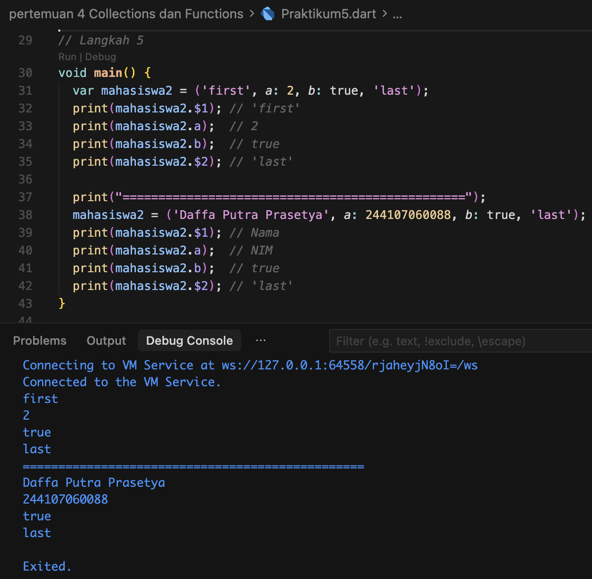

Pada bagian pertama, akses field posisi (`$1`, `$2`) dan field bernama (`a`, `b`) menampilkan nilai awal record `('first', a: 2, b: true, 'last')` sesuai komentar. Setelah record diubah menjadi `('Daffa Putra Prasetya', a: 244107060088, b: true, 'last')`, output menunjukkan bahwa `$1` kini berisi nama dan field bernama `a` berisi NIM. Ini menunjukkan bagaimana record bisa menyimpan dan mengakses data mahasiswa menggunakan kombinasi field posisi dan field bernama.

---

## Tugas Praktikum

### 1. Dokumentasi Praktikum 1–5

Silakan selesaikan Praktikum 1 sampai 5, lalu dokumentasikan berupa screenshot hasil pekerjaan beserta penjelasannya.

**Jawab:**

Sudah ada di atas

### 2. Jelaskan yang dimaksud Functions dalam bahasa Dart!

**Jawab:**

Functions di Dart adalah blok kode yang diberi nama yang dapat dipanggil berulang kali untuk menjalankan suatu logika tertentu. Function dapat menerima parameter, mengembalikan nilai, dan membantu membuat kode lebih terstruktur, reusable, serta mudah diuji.

### 3. Jelaskan jenis-jenis parameter di Functions beserta contoh sintaksnya!

**Jawab:**

- **Parameter posisional wajib**: Harus diisi sesuai urutan.

  ```dart
  void tambah(int a, int b) {}
  ```

- **Parameter posisional opsional**: Ditulis dalam `[]`, boleh tidak diisi.

  ```dart
  void salam([String nama = 'Guest']) {}
  ```

- **Parameter bernama opsional**: Ditulis dalam `{}`, diisi dengan nama parameternya.

  ```dart
  void login({String? username, String? password}) {}
  ```

- **Parameter bernama wajib (`required`)**:

  ```dart
  void register({required String nama, required String email}) {}
  ```

- **Parameter dengan nilai default**: Memberi nilai bawaan jika argumen tidak dikirim.

  ```dart
  void cetak(String pesan, {int repeat = 1}) {}
  ```

### 4. Jelaskan maksud Functions sebagai first-class objects beserta contoh sintaksnya!

**Jawab:**

Functions sebagai *first-class objects* berarti function diperlakukan seperti nilai biasa: bisa disimpan di variabel, dikirim sebagai parameter, atau dikembalikan dari function lain.

```dart
int kaliDua(int x) => x * 2;

void jalankan(Function f, int nilai) {
  print(f(nilai));
}

void main() {
  var fungsi = kaliDua;   // disimpan di variabel
  jalankan(fungsi, 5);    // dikirim sebagai argumen
}
```

### 5. Apa itu Anonymous Functions? Jelaskan dan berikan contohnya!

**Jawab:**

Anonymous function adalah function yang tidak memiliki nama, biasanya dituliskan langsung sebagai ekspresi dan sering dipakai sebagai callback.

```dart
void main() {
  var angka = [1, 2, 3];

  angka.forEach((value) {
    print('Angka: $value');
  });
}
```

Pada contoh di atas, `(value) { print('Angka: $value'); }` adalah anonymous function.

### 6. Jelaskan perbedaan Lexical scope dan Lexical closures! Berikan contohnya!

**Jawab:**

- **Lexical scope**: Ruang lingkup variabel ditentukan oleh posisi penulisan kode (blok/fungsi) saat dikompilasi, bukan saat runtime.

  ```dart
  void main() {
    int x = 10;
    void cetak() {
      print(x);
    }
    cetak();
  }
  ```

- **Lexical closure**: Function yang membawa serta nilai variabel dari scope luar meskipun scope itu sudah selesai dieksekusi.

  ```dart
  Function pembuatPenambah(int n) {
    return (int x) => x + n; 
  }

  void main() {
    var tambahDua = pembuatPenambah(2);
    print(tambahDua(5)); 
  }
  ```

Pada closure, fungsi hasil `pembuatPenambah` tetap mengingat nilai `n` yang didefinisikan di scope luar.

### 7. Jelaskan dengan contoh cara membuat return multiple value di Functions!

**Jawab:**

Di Dart, kita bisa mengembalikan beberapa nilai sekaligus menggunakan `Record` atau dengan membungkusnya dalam objek (class). Berikut contoh menggunakan `Record`
```dart
(int, int) hitungMinMax(List<int> data) {
  var min = data.reduce((a, b) => a < b ? a : b);
  var max = data.reduce((a, b) => a > b ? a : b);
  return (min, max); 
}

void main() {
  var data = [3, 7, 1, 9];
  var (min, max) = hitungMinMax(data);
  print('Min: $min, Max: $max');
}
```

Fungsi `hitungMinMax` mengembalikan dua nilai sekaligus (min dan max) dalam satu record, lalu di-*destructure* menjadi dua variabel terpisah saat dipakai.
