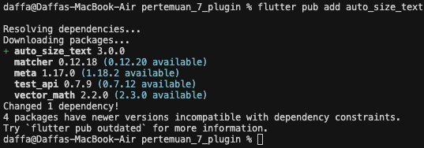
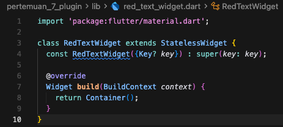
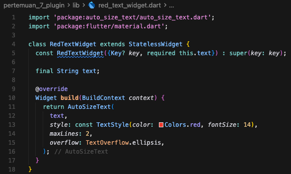
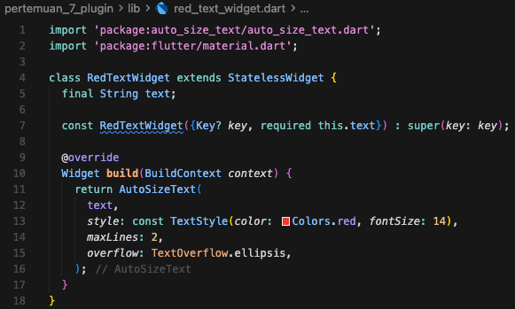
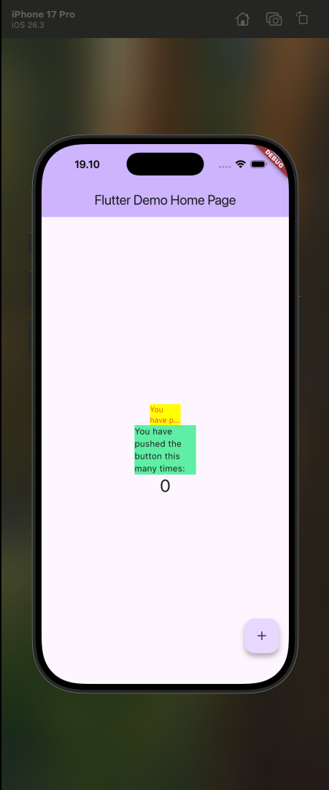

# Praktikum 07 - Manajemen Plugin

| Atribut | Keterangan     |
| ------- | -------------- |
| Nama    | Daffa Putra Prasetya |
| NIM     | 244107060088   |
| Kelas   | SIB-2E         |

---

## Praktikum Menerapkan Plugin di Project Flutter

### Langkah 1: Buat Project Baru
Buatlah sebuah project flutter baru dengan nama flutter_plugin_pubdev. Lalu jadikan repository di GitHub Anda dengan nama flutter_plugin_pubdev.

### Langkah 2: Menambahkan Plugin
Tambahkan plugin auto_size_text menggunakan perintah berikut di terminal
```bash
flutter pub add auto_size_text
```


Jika berhasil, maka akan tampil nama plugin beserta versinya di file pubspec.yaml pada bagian dependencies.


### Langkah 3: Buat file red_text_widget.dart
Buat file baru bernama red_text_widget.dart di dalam folder lib lalu isi kode seperti berikut.
```dart
import 'package:flutter/material.dart';

class RedTextWidget extends StatelessWidget {
  const RedTextWidget({Key? key}) : super(key: key);

  @override
  Widget build(BuildContext context) {
    return Container();
  }
}
```



### Langkah 4: Tambah Widget AutoSizeText
Masih di file red_text_widget.dart, untuk menggunakan plugin auto_size_text, ubahlah kode return Container() menjadi seperti berikut.

```dart
return AutoSizeText(
      text,
      style: const TextStyle(color: Colors.red, fontSize: 14),
      maxLines: 2,
      overflow: TextOverflow.ellipsis,
);
```




### Langkah 5: Buat Variabel text dan parameter di constructor
Tambahkan variabel text dan parameter di constructor seperti berikut.
```dart
final String text;

const RedTextWidget({Key? key, required this.text}) : super(key: key);
```



### Langkah 6: Tambahkan widget di main.dart
Buka file main.dart lalu tambahkan di dalam children: pada class _MyHomePageState
```dart
Container(
   color: Colors.yellowAccent,
   width: 50,
   child: const RedTextWidget(
             text: 'You have pushed the button this many times:',
          ),
),
Container(
    color: Colors.greenAccent,
    width: 100,
    child: const Text(
           'You have pushed the button this many times:',
          ),
),
```

Run aplikasi tersebut dengan tekan F5, maka hasilnya akan seperti berikut.




---

## Tugas Praktikum

1. Selesaikan Praktikum tersebut, lalu dokumentasikan dan push ke repository Anda berupa screenshot hasil pekerjaan beserta penjelasannya di file README.md!
2. Jelaskan maksud dari langkah 2 pada praktikum tersebut!
3. Jelaskan maksud dari langkah 5 pada praktikum tersebut!
4. Pada langkah 6 terdapat dua widget yang ditambahkan, jelaskan fungsi dan perbedaannya!
5. Jelaskan maksud dari tiap parameter yang ada di dalam plugin auto_size_text berdasarkan tautan pada dokumentasi ini !
6. Kumpulkan laporan praktikum Anda berupa link repository GitHub kepada dosen!

### Jawaban Tugas Praktikum

**2. Maksud langkah 2 (Menambahkan Plugin)**

Langkah 2 bertujuan menambahkan package `auto_size_text` ke project agar bisa menggunakan widget dari package tersebut. Perintah `flutter pub add auto_size_text` akan:
- menulis dependency ke `pubspec.yaml`,
- mengunduh package ke cache lokal,
- memperbarui `pubspec.lock` agar versi package yang dipakai tercatat.

Dengan begitu, plugin siap di-import dan digunakan di file Dart.

**3. Maksud langkah 5 (Variabel text dan parameter constructor)**

Langkah 5 bertujuan agar `RedTextWidget` menjadi widget yang dinamis/reusable.  
Dengan menambahkan:
- `final String text;` sebagai data yang ditampilkan, dan
- `required this.text` di constructor,

isi teks bisa dikirim dari luar widget saat dipanggil. Tanpa ini, `AutoSizeText(text, ...)` tidak mengetahui sumber nilai `text`.

**4. Fungsi dan perbedaan dua widget pada langkah 6**

Pada langkah 6, ada dua `Container` yang dipakai untuk membandingkan perilaku teks dalam lebar terbatas:

- **Container pertama** (`width: 50`, kuning) berisi `RedTextWidget` yang menggunakan `AutoSizeText`.  
  Fungsinya menampilkan teks yang lebih adaptif (ukuran teks bisa menyesuaikan ruang, dengan batasan baris dan overflow yang diatur).

- **Container kedua** (`width: 100`, hijau) berisi `Text` biasa.  
  Fungsinya sebagai pembanding widget standar tanpa kemampuan auto-resize seperti `AutoSizeText`.

Perbedaan utama: `AutoSizeText` lebih fleksibel saat ruang sempit, sedangkan `Text` biasa cenderung mengikuti ukuran font tetap.

**5. Maksud parameter pada `AutoSizeText` yang digunakan**

Arti parameter pada kode praktikum:

```dart
AutoSizeText(
  text,
  style: const TextStyle(color: Colors.red, fontSize: 14),
  maxLines: 2,
  overflow: TextOverflow.ellipsis,
)
```

- `text`  
  Isi string yang akan ditampilkan oleh widget.

- `style: TextStyle(...)`  
  Mengatur gaya teks.
  - `color: Colors.red` -> warna teks merah.
  - `fontSize: 14` -> ukuran font awal 14.

- `maxLines: 2`  
  Membatasi teks maksimal 2 baris.

- `overflow: TextOverflow.ellipsis`  
  Jika teks masih tidak muat sesuai batas, bagian akhir teks ditandai tiga titik (`...`).